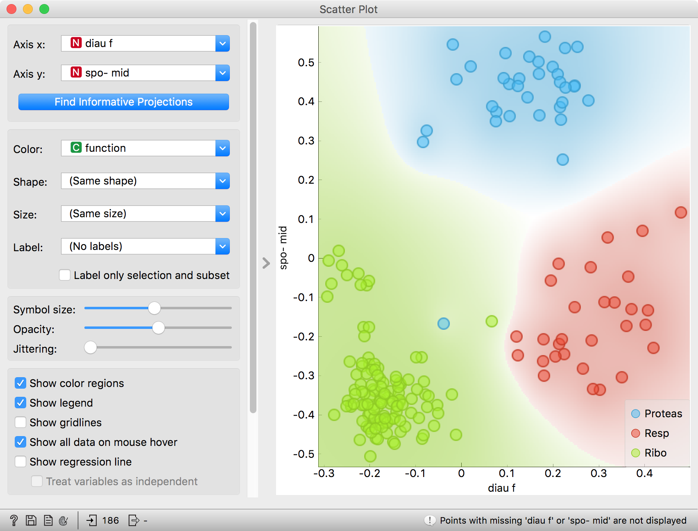

Orange workflows consist of components that read, process, and
visualize data. We refer to these components as “widgets” We place
the widgets on a drawing board called the “canvas” to design a workflow. Widgets communicate by sending information along their communication channel. Output from one widget can be used as input to
another.

<!!! width-max !!!>

<!!! float-aside !!!>
A simple workflow with two connected
widgets and one widget without connections. The outputs of a widget appear on the right, while the inputs appear on the left.

We construct workflows by dragging widgets onto the canvas and
connecting them by drawing a line from the transmitting widget to
the receiving widget. The widget’s outputs are on the right, and the
inputs on the left. In the workflow above, the File widget sends data
to the Data Table widget.

Start by constructing a workflow that consists of a File widget, two
Scatter Plot widgets and two Data Table widgets:

<!!! float-aside !!!>
A workflow with a File widget that
reads the data from a disk and sends
it to the Scatter Plot and Data Table
widget. The Data Table renders the
data in a spreadsheet, while the Scatter Plot visualizes it. The plot’s selected data points are sent to two other
widgets: Data Table (1) and Scatter
Plot (1).

The File widget reads data from your local disk. Open the File
widget by double-clicking its icon. Orange comes with several preloaded data sets. From these (“Browse documentation data sets...”),
choose brown-selected.tab, a yeast gene expression data set.

<!!! float-aside !!!>
Orange workflows often start with a
File widget. The brown-selected data
set comprises 186 rows (genes) and
81 columns. Out of the 81 columns,
79 contain gene expressions of baker’s
yeast under various conditions, one column (marked as a ”meta attribute”)
provides gene names, and one column contains the ”class” value or gene
function.

After you load the data:
1. Open the other widgets.
2. Select a few data points in the Scatter Plot widget and watch as
they appear in the Data Table (1)
3. Use a combination of two Scatter Plot widgets, where the second
scatter plot shows a detail from a smaller region selected in the first
scatter plot.
The following is a side note, but it won’t hurt. The scatter plot for
a pair of random features does not provide much information on gene
function. Does this change with a different choice of feature pairs in
the visualization? Rank projections at the button on the top left of
the Scatter Plot widget can help you find a good feature pair. How do
you think this works? Could the suggested pairs of features be helpful
to a biologist?

<!!! float-aside !!!>

    
    Scatter Plot and Ranking

We can connect the output of the Data Table widget to the Scatter
Plot widget to highlight the chosen data instances (rows) in the scatter
plot.

<!!! float-aside !!!>
In this workflow, we have switched on
the option ”Show channel names between widgets” in File/Preferences.

How does Orange distinguish between the primary data source and
the data selection? It uses the first connected signal as the entire data
set and the second one as its subset. To make changes or to check
what is happening under the hood, double click on the line connecting
the two widgets.

<!!! float-aside !!!>
Orange comes with a basic set of widgets for data input, preprocessing, visualization and modeling. For other tasks, like text mining, network analysis, and bioinformatics, there are add-ons. Check them out by selecting Add-ons... from the Options menu.

The rows in the data set we are exploring in this lesson are gene profiles. We could perhaps use widgets from the Bioinformatics add-on to get more information on the genes we selected in any of the widgets.

